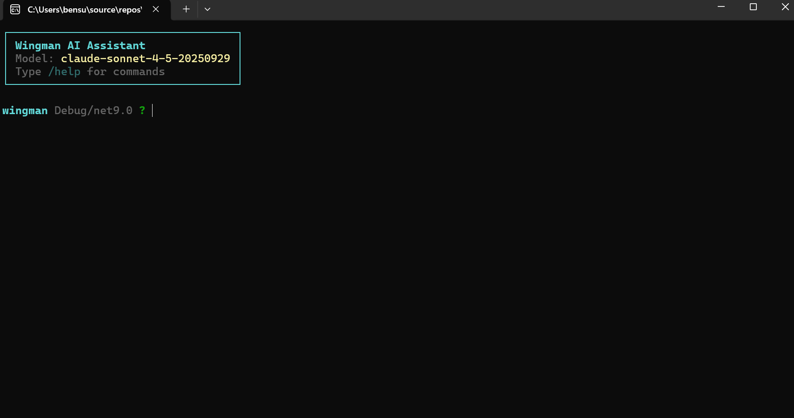

# Wingman - AI File Organization Assistant

An interactive AI assistant for intelligent file organization, powered by Claude AI and Microsoft.Extensions.AI.



## Features

- 🤖 **AI-Powered**: Uses Claude 3.5 Sonnet for intelligent file operations
- 💬 **Interactive REPL**: Chat-based interface with conversation history
- 📁 **File Organization**: List, search, move, copy, and organize files with natural language
- 🔍 **Smart Path Resolution**: Supports absolute paths, relative paths, and natural language directory descriptions
- 🛡️ **Safe Operations**: Preview organization plans before applying, requires explicit approval for destructive operations
- 🎯 **Context-Aware**: Maintains working directory and conversation context

## Prerequisites

- .NET 9.0 SDK or later
- Windows, macOS, or Linux
- Anthropic API key ([get one here](https://console.anthropic.com/))

## Quick Start

### 1. Clone and Build

```bash
git clone <your-repo-url>
cd wingman
dotnet build
```

### 2. Configure API Key

**Option 1: Config File (Recommended)**

Create `wingman.config.json` in either:
- The current directory, OR
- Your home directory (`~\wingman.config.json` or `$HOME/wingman.config.json`)

```json
{
  "ApiKey": "your-anthropic-api-key-here",
  "Model": "claude-3-5-sonnet-20241022",
  "MaxTokens": 4096
}
```

**Option 2: Environment Variable**

```bash
export ANTHROPIC_API_KEY="your_api_key_here"
```

### 3. Run Wingman

```bash
dotnet run --project src/Wingman.Cli
```

### 4. Use Wingman

Once in the REPL, you can chat with Wingman using natural language:

```
wingman ❯ list my downloads folder
wingman ❯ organize files in Documents by extension
wingman ❯ find all PDF files larger than 5MB
wingman ❯ move report.pdf to my Documents folder
```

## REPL Commands

| Command | Description |
|---------|-------------|
| `/help` | Show available commands |
| `/exit` or `/quit` | Exit the REPL |
| `/cwd` | Show current working directory |
| `/cd <path>` | Change working directory |
| `/reset` | Clear conversation history |
| `/clear` | Clear screen |
| `/model <name>` | Switch AI model |

## Available Tools

Wingman has access to the following file operations:

- **ResolvePath**: Quickly resolve file/directory paths (absolute, relative, or by name)
- **FindDirectory**: Search for directories using natural language descriptions
- **ListDirectory**: List files and subdirectories with metadata
- **SearchFiles**: Find files by name pattern, extension, or size
- **MoveItem**: Move files or directories to new locations
- **CopyFile**: Copy files to other locations
- **DeleteItem**: Delete files or directories (requires approval)
- **CreateDirectory**: Create new directories (requires approval)
- **PreviewOrganizeByExtension**: Preview file organization by extension
- **ApplyOrganizationPlan**: Apply an organization plan (requires approval)

All destructive operations require the approval phrase `I_APPROVE_FILE_CHANGES`.

## Project Structure

```
wingman/
├── src/
│   ├── Wingman.Agent/          # Core agent with AI tools and configuration
│   │   ├── Tools/              # File organization tools
│   │   └── Configuration/      # Configuration models
│   ├── Wingman.Cli/            # Interactive REPL CLI
│   └── Wingman.Tests/          # Unit tests
└── README.md                   # This file
```

## Use Cases

- **Organize Downloads**: "Organize my downloads folder by file type"
- **Find Files**: "Find all images larger than 10MB in my Pictures folder"
- **Clean Up**: "List all files in Desktop that are older than 6 months"
- **Move Files**: "Move all PDFs from Downloads to Documents/Reports"
- **Preview Changes**: "Preview organizing my Documents by extension"

## Development

```bash
# Build all projects
dotnet build

# Run tests
dotnet test

# Run the CLI
dotnet run --project src/Wingman.Cli
```

## Architecture

Wingman uses:
- **Microsoft.Extensions.AI**: For unified AI client abstraction
- **Anthropic SDK**: To access Claude AI models
- **Microsoft.Agents.AI**: For AI agent orchestration with tool calling
- **Spectre.Console**: For rich terminal UI

## License

MIT License - see LICENSE file for details

## Contributing

Contributions welcome! Please open an issue or PR.
